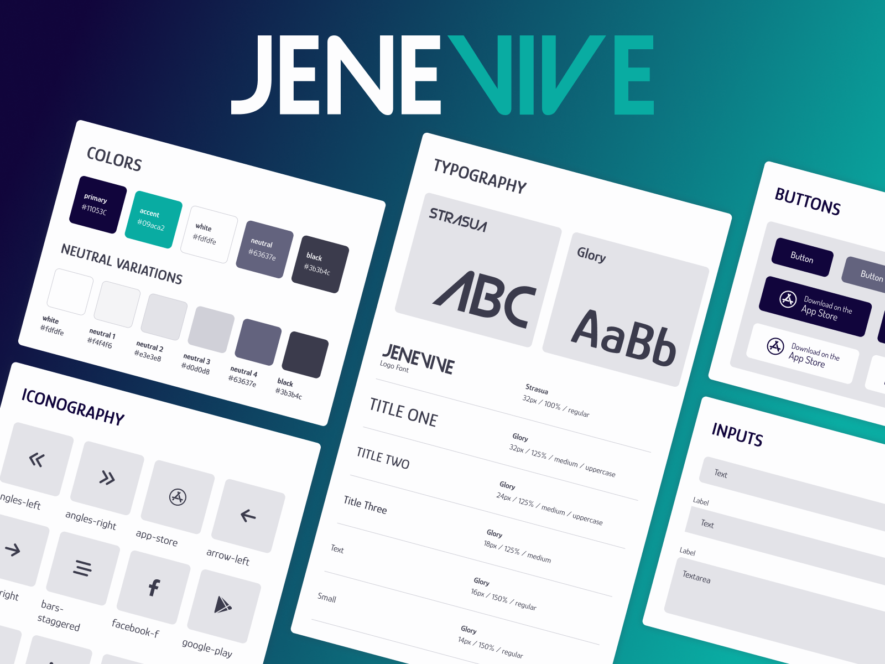

# Design system - Genevive

Design system for a responsive medical startup website using HTML + SCSS + JavaScript.

---


## Demo

- [genevive-design.netlify.app](https://genevive-design.netlify.app)

---


## Development

### 1. Initial install

Run the following in the project directory:

```bash
  npm install
```

Note: This project was created with node 18.16.0 and npm 9.5.1.


### 2. Run development server

```bash
  npm start
```
